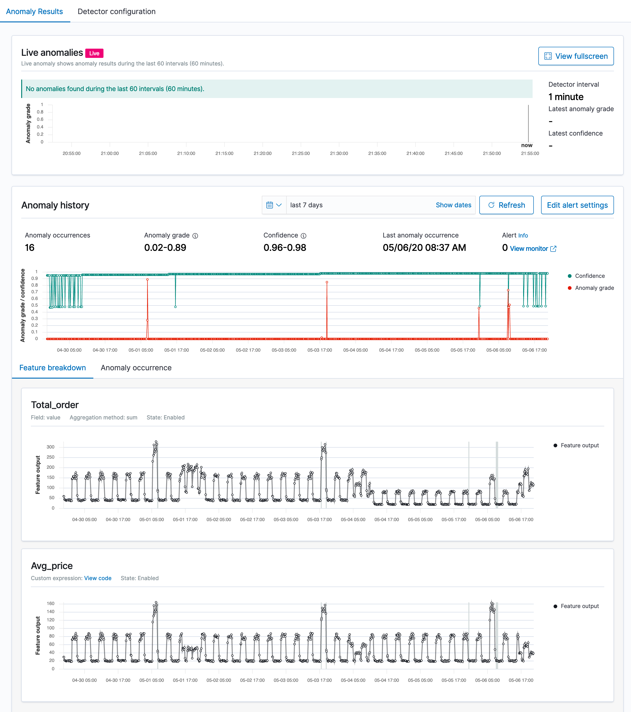

# Anomaly Detection

An anomaly is any unusual change in behavior. Anomalies in your time-series data can lead to valuable insights. For example, for IT infrastructure data, an anomaly in the memory usage metric might help you uncover early signs of a system failure.

Discovering anomalies using conventional methods such as creating visualizations and dashboards can be challenging. You can set an alert based on a static threshold, but this requires prior domain knowledge and is not adaptive to data that exhibits organic growth or seasonal behavior.

The anomaly detection feature automatically detects anomalies in your Elasticsearch data in near real-time using the Random Cut Forest (RCF) algorithm. RCF is an unsupervised machine learning algorithm that models a sketch of your incoming data stream to compute an `anomaly grade` and `confidence score` value for each incoming data point. These values are used to differentiate an anomaly from normal variations. For more information about how RCF works, see [Random Cut Forests](https://pdfs.semanticscholar.org/8bba/52e9797f2e2cc9a823dbd12514d02f29c8b9.pdf?_ga=2.56302955.1913766445.1574109076-1059151610.1574109076).

You can pair the anomaly detection plugin with the [alerting plugin](../alerting/index/) to notify you as soon as an anomaly is detected.

## Get started with Anomaly Detection

To get started, choose **Anomaly Detection** in Kibana.

### Step 1: Create a detector

A detector is an individual anomaly detection task. You can create multiple detectors, and all the detectors can run simultaneously, with each analyzing data from different sources.

1. Choose **Create Detector**.
1. Enter the **Name** of the detector and a brief **Description**. Make sure the name that you enter is unique and descriptive enough to help you to identify the purpose of this detector.
1. For **Data source**, choose the index that you want to use as the data source. You can optionally use index patterns to choose multiple indices.
1. Choose the **Timestamp field** in your index.
1. For **Data filter**, you can optionally filter the index that you chose as the data source. From the **Filter type** menu, choose  **Visual filter**, and then design your filter query by selecting **Fields**, **Operator**, and **Value**, or choose **Custom Expression** and add in your own JSON filter query.
1. For **Detector operation settings**, define the **Detector interval** to set the time interval at which the detector collects data.
- The detector aggregates the data in this interval, then feeds the aggregated result into the anomaly detection model.
The shorter you set this interval, the fewer data points the detector aggregates.
The anomaly detection model uses a shingling process, a technique that uses consecutive data points to create a sample for the model. This process needs a certain number of aggregated data points from contiguous intervals.
- We recommend you set the detector interval based on your actual data. Too long of an interval might delay the results and too short of an interval might miss some data and also not have a sufficient number of consecutive data points for the shingle process.
1. To add extra processing time for data collection, specify a **Window delay** value. This is to tell the detector that the data is not ingested into Elasticsearch in real time but with a certain delay.
Set the window delay to shift the detector interval to account for this delay.
- For example, say the detector interval is 10 minutes and data is ingested into your cluster with a general delay of 1 minute.
Assume the detector runs at 2:00, the detector attempts to get the last 10 minutes of data from 1:50 to 2:00, but because of the 1-minute delay, it only gets 9 minutes of data and misses the data from 1:59 to 2:00.
Setting the window delay to 1 minute, shifts the interval window to 1:49 - 1:59, so the detector accounts for all 10 minutes of the detector interval time.
1. Choose **Create**.

After you create the detector, the next step is to add features to it.

### Step 2: Add features to your detector

In this case, a feature is the field in your index that you to check for anomalies. A detector can discover anomalies across one or more features. You must choose an aggregation method for each feature: `average()`, `sum()`, `min()`, or `max()`. The aggregation method determines what constitutes an anomaly.

For example, if you choose `min()`, the detector focuses on finding anomalies based on the minimum values of your feature. If you choose `average()`, the detector finds anomalies based on the average values of your feature.

You can add a maximum of five features for a detector.
{: .note }

1. On the **Features** page, select **Add features**.
1. Enter the **Name** of the feature.
1. For **Find anomalies based on**, choose the method to find anomalies. For **Field Value** menu, choose the **field** and the **aggregation method**. Or choose **Custom expression**, and add in your own JSON aggregation query.
1. Preview sample anomalies and adjust the feature settings if needed.
- For sample previews, the anomaly detection plugin selects a small number of data samples---for example, one data point every 30 minutes---and uses interpolation to estimate the remaining data points to approximate the actual feature data. It loads this sample dataset into the detector. The detector uses this sample dataset to generate a sample preview of anomaly results.
Examine the sample preview and use it to fine-tune your feature configurations, for example, enable or disable features, to get more accurate results.
1. Choose **Save and start detector**.
1. Choose between automatically starting the detector (recommended) or manually starting the detector at a later time.

### Step 3: Observe the results

Choose the **Anomaly results** tab.

You will have to wait for some time to see the anomaly results.

If the detector interval is 10 minutes, the detector might take more than an hour to start, as it's waiting for sufficient data to generate anomalies.

A shorter interval means the model passes the shingle process more quickly and starts to generate the anomaly results sooner.
Use the [profile detector](./api#profile-detector) operation to make sure you check you have sufficient data points.

If you see the detector pending in "initialization" for longer than a day, aggregate your existing data using the detector interval to check if for any missing data points. If you find a lot of missing data points from the aggregated data, consider increasing the detector interval.

- The **Live anomalies** chart displays the live anomaly results for the last 60 intervals. For example, if the interval is set to 10, it shows the results for the last 600 minutes. This chart refreshes every 30 seconds.
- The **Anomaly history** chart plots the anomaly grade with the corresponding measure of confidence.
- The **Feature breakdown** graph plots the features based on the aggregation method. You can vary the date-time range of the detector.
- The **Anomaly occurrence** table shows the `Start time`, `End time`, `Data confidence`, and `Anomaly grade` for each anomaly detected.

Anomaly grade is a number between 0 and 1 that indicates the level of severity of how anomalous a data point is. An anomaly grade of 0 represents “not an anomaly,” and a non-zero value represents the relative severity of the anomaly. The confidence score is an estimate of the probability that the reported anomaly grade matches the expected anomaly grade. Confidence increases as the model observes more data and learns the data behavior and trends. Note that confidence is distinct from model accuracy.

### Step 4: Set up alerts

To create a monitor to send you notifications when any anomalies are detected, choose **Set up alerts**.
You're redirected to the **Alerting**, **Add monitor** page.

For steps to create a monitor and set notifications based on your anomaly detector, see [Monitor](../alerting/monitors/).

If you stop or delete a detector, make sure to delete any monitors associated with the detector.

### Step 5: Adjust the model

To see all the configuration settings, choose the **Detector configuration** tab.

1. To make any changes to the detector configuration, or fine tune the time interval to minimize any false positives, in the **Detector configuration** section, choose **Edit**.
- You need to stop the detector to change the detector configuration. In the pop-up box, confirm that you want to stop the detector and proceed.
1. To enable or disable features, in the **Features** section, choose **Edit** and adjust the feature settings as needed. After you make your changes, choose **Save and start detector**.
- Choose between automatically starting the detector (recommended) or manually starting the detector at a later time.

### Step 6: Manage your detectors

Go to the **Detector details** page to change or delete your detectors.

1. To make changes to your detector, choose the detector name to open the detector details page.
1. Choose **Actions**, and then choose **Edit detector**.
 - You need to stop the detector to change the detector configuration. In the pop-up box, confirm that you want to stop the detector and proceed.
1. After making your changes, choose **Save changes**.
1. To delete your detector, choose **Actions**, and then choose **Delete detector**.
- In the pop-up box, type `delete` to confirm and choose **Delete**.
