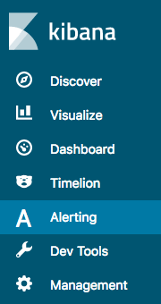

# Alerting
Kibana
{: .label .label-yellow :}

The alerting feature notifies you when data from one or more Elasticsearch indices meets certain conditions. For example, you might want to notify a [Slack](https://slack.com/) channel if your application logs more than five HTTP 503 errors in one hour, or you might want to page a developer if no new documents have been indexed in the past 20 minutes.

Monitors run as the `admin` user, which means that monitors can query all documents in all indices and do not consider the roles of the user who created the monitor. If your cluster contains sensitive data, we recommend [removing the alerting plugin](../install/plugins/#remove-plugins).
{: .warning }

To get started, choose **Alerting** in Kibana.

