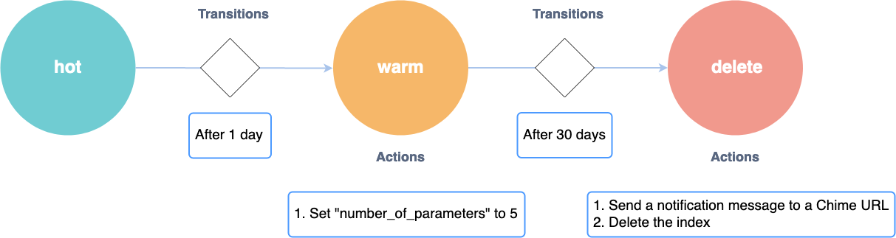

# Index State Management
Kibana
{: .label .label-yellow :}

If you're analyzing time-series data, you may value your data less over time. In that scenario, you may have thought of ways to keep your cost proportional to the underlying value of your data by moving your indices through different states on some fixed schedule.

The Index State Management (ISM) plugin is a built-in UI that lets you automate these periodic, administrative operations by triggering them based on changes in the index age, index size, or number of documents. Using the ISM plugin, you can define a policy that automatically handles index rotation and data retention as per your specific requirements.

For example, you can define a policy that moves your index into a `read_only` state on less expensive hardware after 30 days and then ultimately deletes it after a set period of 90 days.
Or, you might want to perform an index rollover after a certain amount of time, take a snapshot prior to the rollover, or run the `_forcemerge` API on an index during off-peak hours to improve search performance during peak hours.

## Get started with ISM

To get started, choose **Index Management** in Kibana.

* Step 1: Set up policies

    1. Make sure the **Policies** tab is selected.
    2. Choose **Create policy**.
    3. In the **Policy** section, enter a policy ID.
    4. In the **Define policy** section, enter your policy.
    5. Choose **Create**.

For information on how to create a policy, see [Policies](../ism/policies).

After creating a policy, the next step is to apply this policy to an index or indices. Policies can be associated with one or more index templates.

* Step 2: Apply policies to indices

    1. Choose **Indices**.
    2. Select the index or indices to which you want to apply your policy.
    3. Choose **Add policy**.
    4. From the dropdown menu, select the policy that you created.
    5. Choose **Add**.

Once a policy is applied to an index, a background task continuously checks if the conditions defined in the policy are met and then executes the actions set in the policy when that happens.

You can only apply policies to indices that contain ISM settings. For information on how to create an index with ISM settings, see [Indices](../ism/indices).

* Step 3: Manage Indices

    1. Choose **Managed Indices**.
    2. To change your policy, choose **Change policy**.
    3. To attach a rollover alias to your index, select your policy and choose **Add rollover alias**.
    4. To remove a policy, select your policy and choose **Remove policy**.
    5. To retry a policy, select your policy and choose **Retry policy**.

For information on how to automate the policy management process, see [Managed Indices](../ism/managedindices).

* Step 4: Settings

We don't recommend changing the settings; the defaults should work well for most use cases.

For information about settings, see [Settings](../ism/settings).

* Step 5: Security

The ISM plugin needs to be run with full admin access.

* Step 6: Refer to ISM operations

For a complete list of supported operations, see [ISM API](../ism/api).
