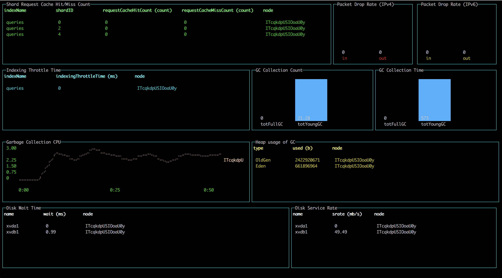

# Performance Analyzer

Performance Analyzer is a REST API that allows you to query numerous performance metrics for your cluster, including aggregations of those metrics, independent of the Java Virtual Machine (JVM). PerfTop is the default command line interface (CLI) for displaying those metrics.




## Get started with PerfTop

The basic syntax is:

```bash
./perf-top-<operating_system> --dashboard <dashboard>.json --endpoint <endpoint>
```

If you're running PerfTop from a node (i.e. locally), specify port 9600:

```bash
./perf-top-linux --dashboard dashboards/<dashboard>.json --endpoint localhost:9600
```

Otherwise, just specify the Elasticsearch endpoint:

```bash
./perf-top-macos --dashboard dashboards/<dashboard>.json --endpoint my-cluster.my-domain.com
```

PerfTop has four pre-built dashboards in the `dashboards` directory, but you can also [create your own](dashboards).
You can also load the pre-built dashboards (ClusterOverview, ClusterNetworkMemoryAnalysis, ClusterThreadAnalysis, or NodeAnalysis) without the JSON files , such as `--dashboard ClusterThreadAnalysis`.

PerfTop has no interactivity. Start the application, monitor the dashboard, and press `escape`, `q`, or `ctrl-c`  to quit.
{: .note }


### Other options

- For `NodeAnalysis.json` and similar custom dashboards, you can add the `--nodename <node_name>` argument if you want your dashboard to display metrics for only a single node.
- For troubleshooting, add the `--logfile <log_file>.txt` argument.
