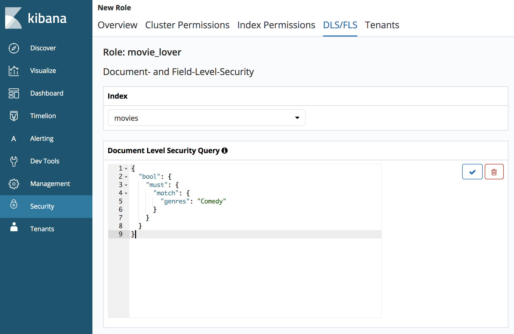

# Document-level security

Document-level security lets you restrict a role to a subset of documents in an index. The easiest way to get started with document- and field-level security is open Kibana and choose **Security**. Then choose **Roles**, create a new role, and review the **Index permissions** section.




## Simple roles

Document-level security uses the Elasticsearch query DSL to define which documents a role grants access to. In Kibana, choose an index pattern and provide a query in the **Document level security** section:

```json
{
  "bool": {
    "must": {
      "match": {
        "genres": "Comedy"
      }
    }
  }
}
```

This query specifies that for the role to have access to a document, its `genres` field must include `Comedy`.

A typical request to the `_search` API includes `{ "query": { ... } }` around the query, but in this case, you only need to specify the query itself.

In the REST API, you provide the query as a string, so you must escape your quotes. This role allows a user to read any document in any index with the field `public` set to `true`:

```json
PUT _opendistro/_security/api/roles/public_data
{
  "cluster_permissions": [
    "*"
  ],
  "index_permissions": [{
    "index_patterns": [
      "pub*"
    ],
    "dls": "{\"term\": { \"public\": true}}",
    "allowed_actions": [
      "read"
    ]
  }]
}
```

These queries can be as complex as you want, but we recommend keeping them simple to minimize the performance impact that the document-level security feature has on the cluster.
{: .warning }


## Parameter substitution

A number of variables exist that you can use to enforce rules based on the properties of a user. For example, `${user.name}` is replaced with the name of the current user.

This rule allows a user to read any document where the username is a value of the `readable_by` field:

```json
PUT _opendistro/_security/api/roles/user_data
{
  "cluster_permissions": [
    "*"
  ],
  "index_permissions": [{
    "index_patterns": [
      "pub*"
    ],
    "dls": "{\"term\": { \"readable_by\": \"${user.name}\"}}",
    "allowed_actions": [
      "read"
    ]
  }]
}
```

This table lists substitutions.

Term | Replaced with
:--- | :---
`${user.name}` | Username.
`${user.roles}` | A comma-separated, quoted list of user roles.
`${attr.<TYPE>.<NAME>}` | An attribute with name `<NAME>` defined for a user. `<TYPE>` is `internal`, `jwt` or `ldap`


## Attribute-based security

You can use roles and parameter substitution with the `terms_set` query to enable attribute-based security.

#### User definition

```json
PUT _opendistro/_security/api/internalusers/user1
{
  "password": "asdf",
  "backend_roles": ["abac"],
  "attributes": {
    "permissions": "\"att1\", \"att2\", \"att3\""
  }
}
```

#### Role definition

```json
PUT _opendistro/_security/api/roles/abac
{
  "index_permissions": [{
    "index_patterns": [
      "*"
    ],
    "dls": "{\"terms_set\": {\"security_attributes\": {\"terms\": [\"${attr.internal.permissions}\"], \"minimum_should_match_script\": {\"source\": \"doc['security_attributes'].values.length\"}}}}",
    "allowed_actions": [
      "read"
    ]
  }]
}
```
