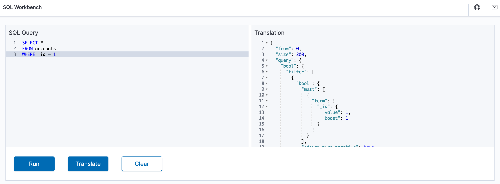

# SQL

Open Distro for Elasticsearch SQL lets you write queries in SQL rather than the [Elasticsearch query domain-specific language (DSL)](../elasticsearch/full-text). If you're already familiar with SQL and don't want to learn the query DSL, this feature is a great option.


## Workbench

The easiest way to get familiar with the SQL plugin is to use **SQL Workbench** in Kibana to test various queries. To learn more, see [Workbench](workbench/).




## REST API

To use the SQL plugin with your own applications, send requests to `_opendistro/_sql`:

```json
POST _opendistro/_sql
{
  "query": "SELECT * FROM my-index LIMIT 50"
}
```

Here’s how core SQL concepts map to Elasticsearch:

SQL | Elasticsearch
:--- | :---
Table | Index
Row | Document
Column | Field

You can query multiple indices by listing them or using wildcards:

```json
POST _opendistro/_sql
{
  "query": "SELECT * FROM my-index1,myindex2,myindex3 LIMIT 50"
}

POST _opendistro/_sql
{
  "query": "SELECT * FROM my-index* LIMIT 50"
}
```

For a sample [curl](https://curl.haxx.se/) command, try:

```bash
curl -XPOST https://localhost:9200/_opendistro/_sql -u admin:admin -k -H 'Content-Type: application/json' -d '{"query": "SELECT * FROM kibana_sample_data_flights LIMIT 10"}'
```

By default, queries return data in JDBC format, but you can also return data in standard Elasticsearch JSON, CSV, or raw formats:

```json
POST _opendistro/_sql?format=json|csv|raw
{
  "query": "SELECT * FROM my-index LIMIT 50"
}
```

See the rest of this guide for detailed information on request parameters, settings, supported operations, tools, and more.


## Contributing

To get involved and help us improve the SQL plugin, see the [development guide](https://github.com/opendistro-for-elasticsearch/sql/blob/master/docs/developing.rst) for instructions on setting up your development environment and building the project.
